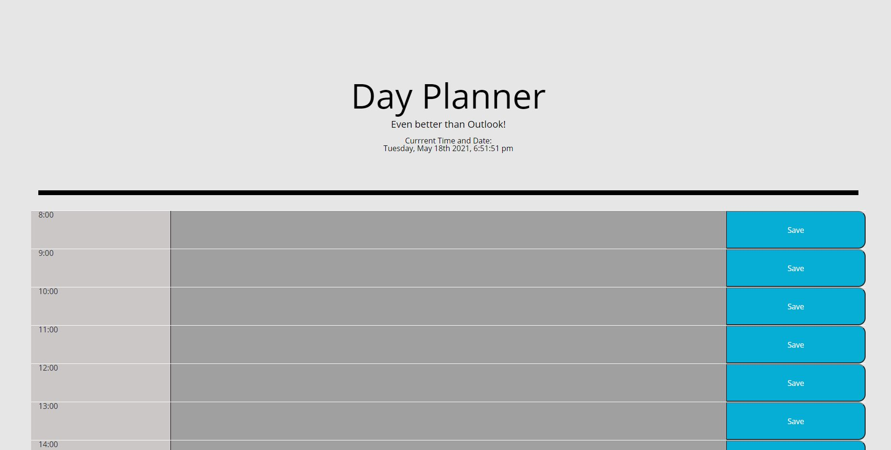

# <Day Planner>
## This Day planner was made so you can save an event into the time block for the day. It grabs the current time with moment and then compares that time to the hour of the day. Times are highlighted in colors based on past, present, or future hours.

 

## Screenshot

## Link to deployed app

[Link to deployed webpage](https://michaelzadra27.github.io/DayPlanner/)

## Credits
